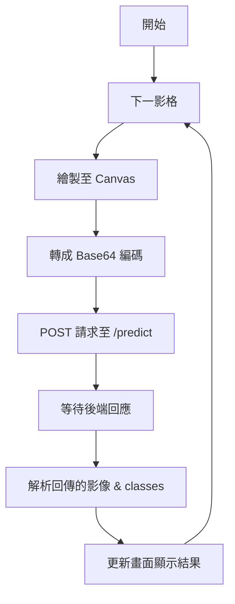
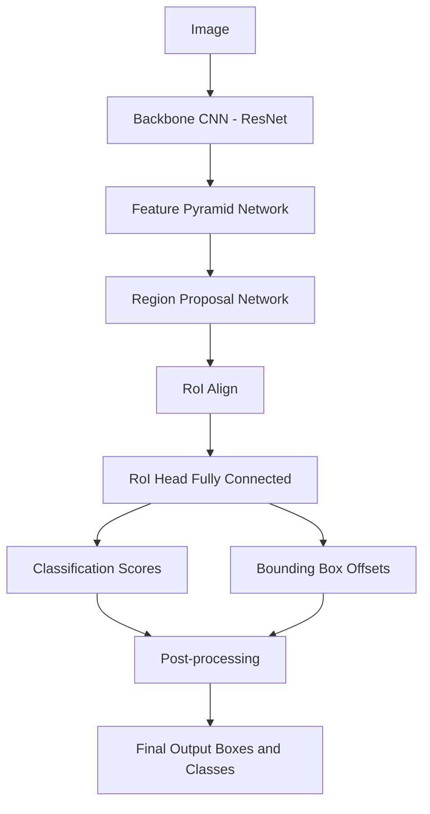

# Road Surface Real-time Recognition Project

This repository contains code and resources for road surface defect detection using deep learning.

## Getting Started

**Please use the [`Realtime_Road_Surface_Recognition`](Realtime_Road_Surface_Recognition/) folder for all main features, including the web server and inference scripts.**


## Folders and Files

- [`Realtime_Road_Surface_Recognition/`](Realtime_Road_Surface_Recognition/): Main project code (Flask server, inference, web UI, etc.)
- `archive/`, `OLD_FILES/`: Legacy files and datasets (not required for main usage)
- `ckpt/`: Model checkpoints
- `train.py`: Code for training the model.
- `inference_image.py`: Script for running inference on single images.
- `inference_video.py`: Script for running inference on video streams or files.


## Notes

- For HTTPS support, see the self-signed certificate instructions in [`Realtime_Road_Surface_Recognition/README.md`](Realtime_Road_Surface_Recognition/README.md).
- For any issues, please check the documentation in the main project folder.

---
For more details, see [`Realtime_Road_Surface_Recognition/README.md`](Realtime_Road_Surface_Recognition/README.md).

## Usage
```bash
# environments and  dependencies, assume you've installed anaconda.
conda env create -f environment.yml

# and activate this env (with the name torch312)
conda activate torch312
```
```bash
# open a web-server on localhost:5000
cd Realtime_Road_Surface_Recognition
python app.py
```
**And now, you can use another device to connect the `https://<server-ip>:5000`, and enjoy the congnition functionality!**
> **Note:**  
> Remember to replace `<server-ip>` with your actual server's IP address.  
> You must use **https** (not http) to allow your phone's camera to be accessible in the web interface.

## App flowchart


## fasterrcnn_resnet50_fpn 模型架構


## Coding Flowchart

```mermaid
flowchart TD
  subgraph Inference_Code_Video
    V1[逐張讀取影片影格]
    V2[將影格轉為 PIL 影像格式]
    V3[對每個影格進行模型推論]
    V4[畫出邊界框後重建回影片]
    V1 --> V2 --> V3 --> V4
  end
  subgraph Inference_Code_Image
    I1[讀取圖片資料夾中的圖片]
    I2[載入訓練好的模型權重]
    I3[對圖片進行轉換與預測]
    I4[畫出邊界框並儲存結果圖片]
    I1 --> I2 --> I3 --> I4
  end
  subgraph Training_Code
    T1[載入訓練與驗證資料集]
    T2[建立 DataLoader]
    T3[載入預訓練模型並修改 Head]
    T4[執行訓練與驗證迴圈]
    T5[儲存每個 epoch 的模型檔案]
    T1 --> T2 --> T3 --> T4 --> T5
  end
```
