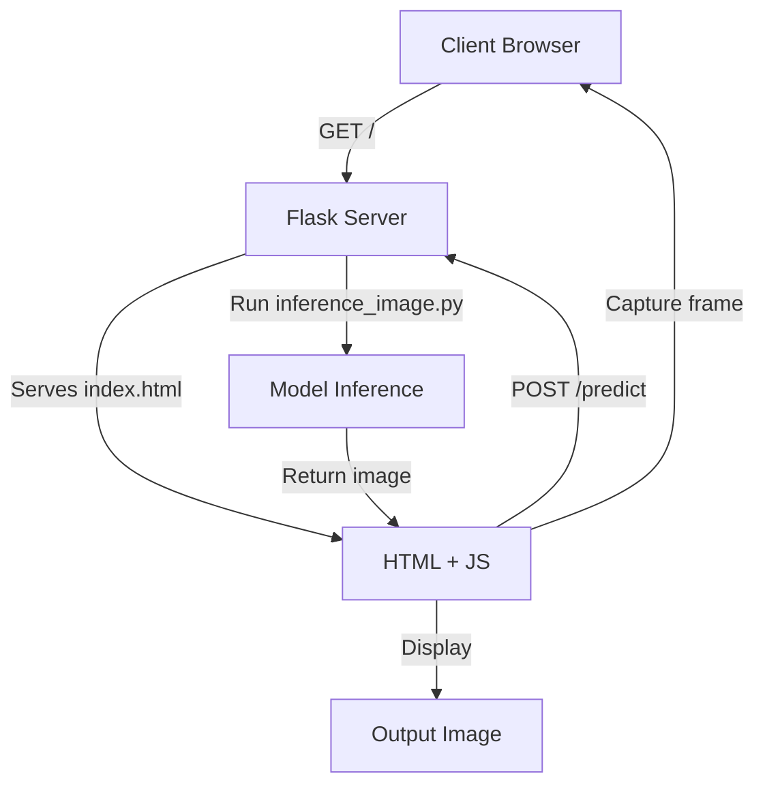

# Road Surface Real-time Recognition System (HTTPS + Self-Signed SSL)

## 專案介紹
本專案利用 Flask 建立 Web 伺服器，並結合 Faster R-CNN 模型，實現對每一影格的路面缺陷（如坑洞、裂縫、井蓋）即時偵測。專案同時示範如何產生自簽 SSL 憑證，啟用 HTTPS，解決行動裝置瀏覽器因非安全連線無法存取相機的問題。

## 自簽憑證產生步驟
1. 安裝 OpenSSL（如尚未安裝）。
2. 執行以下指令產生 `cert.pem` 與 `key.pem`：
    ```bash
    openssl req -x509 -newkey rsa:4096 \
      -keyout key.pem -out cert.pem \
      -days 365 -nodes \
      -subj "/C=TW/ST=Taipei/L=Taipei/O=YourOrg/OU=YourUnit/CN=your.server.ip"
    ```
3. 將 `cert.pem` 和 `key.pem` 放置於專案根目錄。

## 使用說明
1. **啟動 Conda 環境**
    ```bash
    conda env create -f ../environment.yml
    conda activate your_env_name
    ```
2. **啟動伺服器**
    ```bash
    python app.py
    ```
3. **手機瀏覽器連線**
    在手機瀏覽器輸入 `https://<server-ip>:5000`，允許存取相機，即可開始即時辨識。

## 專案結構
```bash
├── app.py   # 主程式，負責啟動 Flask 伺服器與處理路面辨識請求
├── inference_image.py       # 推論核心程式
├── templates/
│   └── index.html          # 前端頁面
└── README.md               # 專案說明
```

## 系統流程
