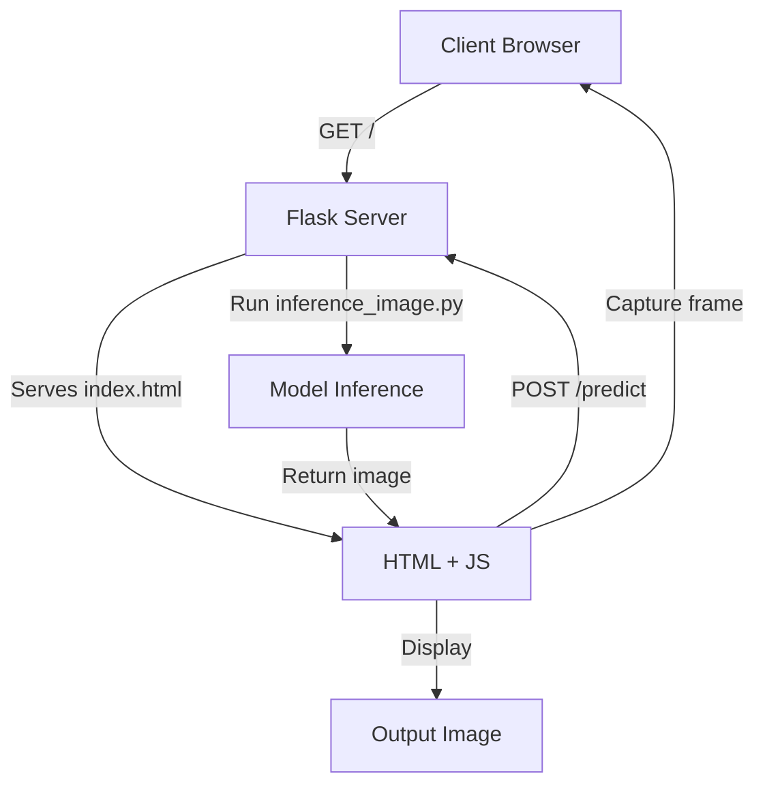

# Road Surface Real-time Recognition System

## 專案介紹
本專案透過 Flask 建置一個 Web 伺服器，並使用 Faster R-CNN 模型對每一影格進行路面缺陷（坑洞、裂縫、井蓋）偵測。

## 使用方式
1. **啟動 Conda 環境**  
   ```bash
   conda activate your_env_name
2. **安裝相依套件**
    ```bash
    pip install flask pillow torchvision torch
3. **啟動伺服器**
    ```bash
    python app.py
4. **連線手機瀏覽器**
    在手機瀏覽器輸入: http://<server-ip>:5000，允許存取相機即可開始實時辨識。

## 專案結構
```bash
├── app.py
├── inference_image.py       # 推論核心程式
├── templates/
│   └── index.html          # 前端頁面
├── results/                # 推論後影像存放
└── README.md               # 專案說明
```
## Workflow
