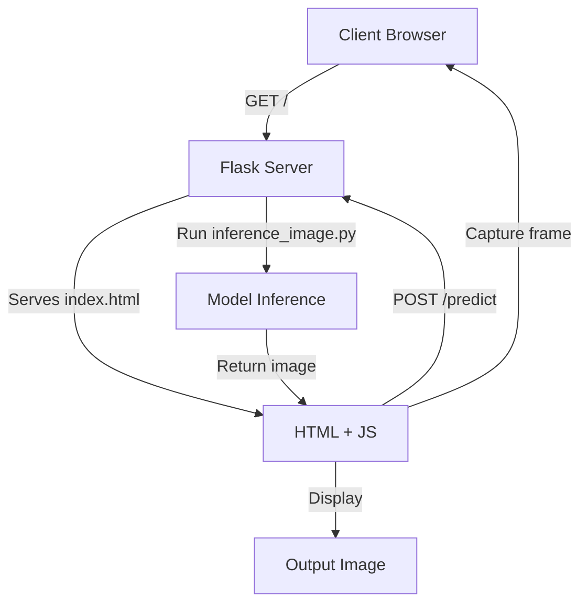

# Road Surface Real-time Recognition System (HTTPS + Self-Signed SSL)

## 專案介紹
本專案透過 Flask 建置一個 Web 伺服器，並使用 Faster R-CNN 模型對每一影格進行路面缺陷（坑洞、裂縫、井蓋）偵測。
另外示範如何使用自簽 SSL 憑證啟用 HTTPS，以解決行動裝置瀏覽器在非安全連線下無法存取相機的問題。

## Self-Signed 憑證產生
1. 安裝 OpenSSL（若尚未安裝）。
2. 執行以下指令，產生 `cert.pem` 和 `key.pem`：
   ```bash
   openssl req -x509 -newkey rsa:4096 \
     -keyout key.pem -out cert.pem \  
     -days 365 -nodes \
     -subj "/C=TW/ST=Taipei/L=Taipei/O=YourOrg/OU=YourUnit/CN=your.server.ip"
3. 將 cert.pem、key.pem 放在專案根目錄。

## 使用方式
1. **啟動 Conda 環境**  
   ```bash
   conda activate your_env_name
2. **安裝相依套件**
    ```bash
    pip install flask pillow torchvision torch
3. **啟動伺服器**
    ```bash
    python app.py
4. **連線手機瀏覽器**
    在手機瀏覽器輸入: http://<server-ip>:5000，允許存取相機即可開始實時辨識。

## 專案結構
```bash
├── app.py
├── inference_image.py       # 推論核心程式
├── templates/
│   └── index.html          # 前端頁面
├── results/                # 推論後影像存放
└── README.md               # 專案說明
```
## Workflow
